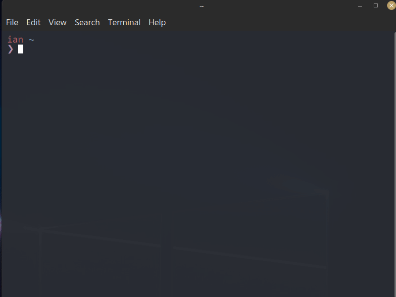

# pscomplete
cross-platform powershell autocomplete

NOTE: this is a work in progress

- Rewritten from scratch to make it compatible with mac/linux

- This is the only powershell tab-expansion compatible with all platforms, as all the other ones use windows-only functions to access the buffer array.

#### demo  

(the tearing is from shitty linux nvidia drivers ❤)

#### installation

- `Install-Module -Name PsComplete`
- `Install-PsComplete`
- After that Tab is bound to the expander

optionally add Install-PsComplete to profile (`Invoke-Item $PROFILE`)

#### features

- Search with regex (`^<start>.*<filter>`)
- Absolutely zero customization (for now)
- Written in F# (nice)
- Performant (handles tens of thousands of completions without breaking a sweat)
- Press Tab again to immediately chain the next argument (useful for switches)
- Press Enter to finish command

#### caveats

Since powershell core hasn't implemented some functions on linux/mac this introduces some caveats.

namely:
- Only works when there is enough free space under the current (use clear)
- Only continuous blocks can be colored with reasonable performance

<!-- GetBufferContents
SetBufferContents -->

